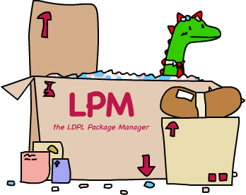
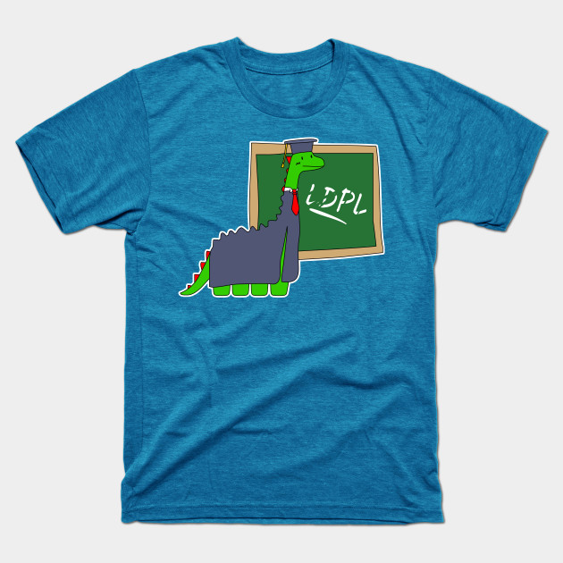
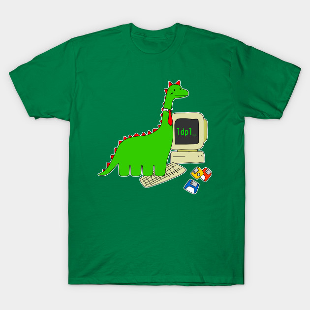
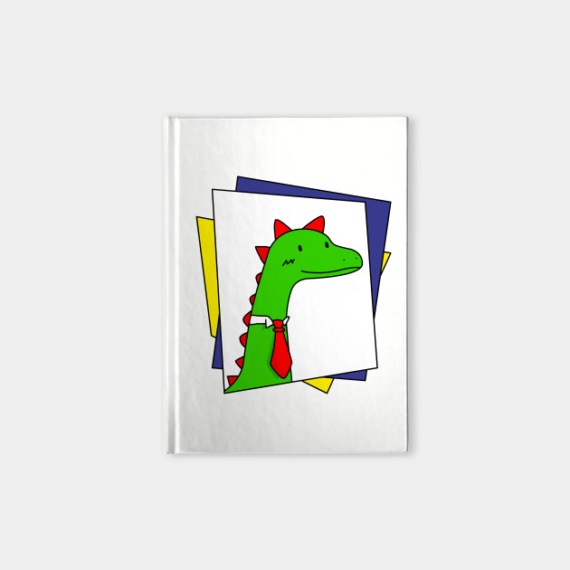

# The LDPL Programming Language


[](https://travis-ci.org/Lartu/ldpl)


[**LDPL**](https://www.ldpl-lang.org/) is a powerful transpiled programming language designed from the ground up to be excessively **expressive**, **readable**, **fast** and **easy** to learn. It mimics plain English, in the likeness of the good parts of older programming languages like COBOL, with the desire that it can be understood by anybody. It's very portable and runs on a plethora of different architectures and operating systems including AMD-64 Windows, Linux, macOS, ARMv8 Linux, Android and both Intel and PowerPC OS X (*tested from Tiger 10.4 onwards*). It even supports UTF-8 out of the box.

This repository contains the source code and [releases](https://github.com/Lartu/ldpl/releases) of the LDPL compiler, LPM (the LDPL Package Manager) and other useful goodies.

### 📒 Example LDPL code

```coffeescript
data: 
  name is text     # Your name goes here! 
  age is number
  
procedure: 
  # Simple Hello World
  display "Hello World" crlf "What's your name? " 
  accept name 
  display "你好, " name "! How old are you?" crlf
  accept age
  if age is greater than 200 then
    display "Woah, you are really old!" crlf
  end if
```

This code greets the user, asks them what their name is and then prints *你好, &lt;name&gt;!! How old are you?* followed by a line-break. Then asks them for their age and, if they enter a number greater than 200, it prints *Woah, you are really old!*, followed by a line-break. Easy as pie and super legible. Check the [official website](https://www.ldpl-lang.org/) and the [examples](/examples) subfolder for more examples, including a Brainf*ck interpreter and Bellman-Ford's Algorithm!

### 🎏 What can I use LDPL for?

LDPL can be used to write software just like any other language you know. You can open, edit and save files, do math,
parse and modify text, etc. Some of these tasks are made easier by the fact that LDPL natively knows how to work with
UTF-8 strings. By using the [available libraries](https://github.com/Lartu/ldpl#-some-other-ldpl-libraries), LDPL becomes
a language *specially* well suited for writing **Telegram Bots**, **IRC Bots** and **Simple Network Servers**.
Code written in LDPL is easy to read, runs fast and can easily interface with C++ code,
so you can do anything you want, really.

## 📯 LDPL Philosophy

LDPL is a language designed to be easy to understand and simple to write. Designed to be easy to learn and simple to use.
We believe that coding should be easy and simple. Nothing should become a frustrating chore. Compiling source code should be easy and
simple: a single, flagless command should be enough to compile any source code. Every statement in the language should do 
one and one thing only, not multiple things depending on the context. Complex, low level stuff like encoding, sockets, 
floating point number comparison, etc., should be dealt by the compiler, transparently to the user. Hard stuff should be
made easier.

We understand that this philosphy may lead to longer source code, more verbose statements and extra steps to reach an end,
but we also believe that it should make coding in LDPL easier and more enjoyable than in other languages.

As one user once put it, *"Usually when I'm programming, I feel like I'm in a big fancy jet and there's a lot of turbulence and it's not going well but then all of a sudden it's smooth air again and the drink cart comes along and I get a ginger ale and it's great. But with LDPL, I feel like I'm a cub scout out in the woods with a box of matches and a hatchet and my Scout's Handbook (the LDPL Docs) just exploring and figuring it out as I go. Whenever I run into a problem I just check my handbook and, sure enough, there's a solution right there waiting for me!"*.

We want to make LDPL a language you'll love not because it lets you do many things in one line, nor because of the way
it runs, nor because of how modern it is: but because it's designed to stay by your side and tell you everything's gonna
be okay even when times get dark.

## 💾 How to install LDPL

You can get yourself a precompiled LDPL binary or compile LDPL from source. Check the following table if you are not sure of what to do.

| **If you want to download a compiled binary** | **If you want to build LDPL yourself** |
| ---                                           | --- |
| Compiled binaries contain the latest stable release. Might not be up to date with the newest, bleeding edge features, but will work fine on most systems and are already compiled for you. | Building LDPL yourself gives you access to the latest features of the language. Development LDPL code tends to be stable, compile and work fine, but hidden bugs may still lurk in there! |
| **How to:** [download the latest stable release available](https://github.com/Lartu/ldpl/releases). You should then move the binary to a folder on your PATH. | **How to:** first, clone this repository. Then `make` (or `mingw32-make` on Windows) and `make install` (or `mingw32-make install` on Windows) LDPL in the `src` folder. This will install LDPL and the LDPL documentation (`man ldpl`, not available on Windows) on your system. LDPL requires only C++11 to compile. |

Once you have LDPL installed on your system, check the LDPL reference to learn how to use the language. Information on how to compile LDPL scripts and a list of LDPL compatible editors is provided in the sections below.

Please note that in order to compile LDPL on **Windows** you must have [Mingw-w64](https://sourceforge.net/projects/mingw-w64/files/Toolchains%20targetting%20Win32/Personal%20Builds/mingw-builds/installer/mingw-w64-install.exe/download) installed on your system. We only support Win32 threads so when installing Mingw-w64 be sure to choose that option.

## 📝 LDPL compatible editors

   

We have highlighting and code formatting extensions available for [Visual Studio Code](https://marketplace.visualstudio.com/items?itemName=Lartu.ldpl-vsc-extension) (thanks to [dvkt](https://github.com/dvkt) and [Lartu](http://github.com/lartu)), [vim](https://github.com/araml/ldpl.vim) (thanks to [Araml](https://github.com/araml)), [Atom](https://atom.io/packages/language-ldpl) (thanks to [Damián Garro](https://github.com/dgarroDC)) and [nano](https://github.com/Lartu/ldpl/tree/master/highlighting/nano) (by [Lartu](http://github.com/lartu)).

You can use any other editor (without syntax highlighting) if you like. If know how to write syntax packages for other editors and would like to contribute to the LDPL project, a highlighting extension would be a very welcome contribution.

## 📚 Learning LDPL and LDPL Documentation


If you want to learn how to code in LDPL, there's a little **tutorial** at https://learnxinyminutes.com/docs/ldpl/.

[The **LDPL documentation** is available here](https://docs.ldpl-lang.org). Check that to learn yourself some LDPL (*for the greater good!*). The documentation is also uploaded to the [ldpl-docs](https://github.com/lartu/ldpl-docs) GitHub repository and can be read and forked from there.

The LDPL documentation can also be found on your system using `man ldpl` when you install LDPL by using `make install`. The man page is also
available in the [man](/man) folder of this repository.

## 💻 How to use this compiler

To use the compiler, you must have a C++ compiler already installed on your system and have mapped it to `c++`, found on your `PATH`. The LDPL Compiler compiles LDPL code to C++ code and thus this is a requirement for it to work.

Once the compiler is set up, go write some LDPL source code, say `source.lsc`.
Then compile the source code using `ldpl source.lsc`. The compiled, executable binary file will be saved as `source-bin`.
Done! For more info on the compiler run `ldpl -h`.

### 🔧 Compiler options

 * The `-f` flag can be used to pass extra options to the compiler when building extensions. For example, `-f=-lSDL` could be used to link against SDL.
 * By using `-r` you can just compile the project and print the C++ representation for that code.
 * You can set the output file for the compiled binary with the `-o` flag. For example, if you want to name your program "dog", you could compile it with `ldpl -o=dog main.ldpl`.
 * On Windows and Linux platforms, LDPL builds static binaries by default. If you want to build non-static ones use the `-ns` flag.
 * The `-c` flag tells LDPL to accept source code from the standard input. 
 * You can import extensions to your LDPL compilation by using the `-i=` flag. Extensions can be imported by passing `.o`, `.a`, or `.cpp` files to this flag; see the Extensions section below.
 * `-v` and `--version` print out version info and release details.
 * `-h` and `--help` print this list of options.

### 📦 C++ extensions

LDPL supports extensions written in C++. Extensions are `.cpp`, `.o`, or `.a` files that can be imported into your program using the `-i=` compiler flag. For example `ldpl -i=lib.cpp source.ldpl`.

For a guide to writing and building C++ extensions, see [LDPL's official documentation](https://docs.ldpl-lang.org/extensions/c++-extensions). For a simple example, see the [examples/cpp-extension](./examples/cpp-extension) directory.

## 🏛 Libraries



Starting from version 4.3, LDPL includes the **LDPL Package Manager** (LPM). When you install LDPL from source you also install LPM. If you download a pre-compiled binary, LPM is included in the same package. With LPM, downloading and using libraries (we also call them *packages*) is now easier than ever:
 - Run `lpm info <library_name>` to find information about a particular library. Try, for example, `lpm info std-math` and `lpm info ltb`!
 - Run `lpm install <library_name>` to install a particular library.
 - Run `lpm uninstall <library_name>` to uninstall a particular library.
 - Run `lpm count` to display the number of installed packages.
 - Run `lpm list` to list all installed packages.
 
Once you've installed a library, you can include it to your project by just adding the line

```coffeescript
include <library_name> # for example: include std-math
```

before the `DATA` and `PROCEDURE` sections of your source file!

### 📖 The LDPL Standard Library

A number of useful statements and subroutines are available in the [**LDPL Standard Library**](https://github.com/Lartu/ldpl-std). Just `lpm install` and `INCLUDE` the desired files in your sourcecode and you are ready to go. For more information check the LDPL Standard Library repository.

### 🦕 Some other LDPL Libraries

- [**The LDPL Network Server Library**](https://github.com/Lartu/ldpl-net-server/): the LDPL Network Server Library is an library for creating socket based servers in LDPL. It aims to make it very easy to develop, test and deploy network servers, with as little work as possible.
- [**The LDPL Telegram Bot Library**](https://github.com/dgarroDC/ltb): this simple LDPL library lets you create a Telegram bot that can receive and send text messages. Install with: `lpm install ltb`.
- [**The LDPL IRC Bot Library**](https://github.com/Lartu/ldpl-irc-bot): the LDPL IRC Bot Library lets you write LDPL programs that connect to IRC servers, join channels, send messages and more in the simplest
way possible.
- [**LDPLNOISE**](https://github.com/dvkt/ldplnoise): LDPL extension with linenoise support. Linenoise is a minimal, zero-config, BSD licensed, readline replacement used in Redis, MongoDB, and Android.

## 👨🏼‍💻 How can I contribute to LDPL?

If you want to contribute to LDPL you can add statements to the language (that's in fact really easy!), fix bugs, add issues, write examples, write some software in LDPL, add statements to the [Standard Library](https://github.com/Lartu/ldpl-std), etc. Check out the [contribution guide](/CONTRIBUTING.md) for more information. Anything is very welcome! Even telling your friends about LDPL is a very easy and very useful contribution!


Contributors are expected to behave by the [LDPL Code of Conduct](/CODE_OF_CONDUCT.md). Tl;dr: be nice to everyone.

If you want to talk to the rest of us, you can find the LDPL community at [r/LDPL](https://reddit.com/r/LDPL) and via IRC on [irc.freenode.net](http://irc.freenode.net/), channel *\#ldpl*. Also on Telegram via the [ldpllang](https://t.me/ldpllang) group. The IRC and Telegram channels are bridged. You are welcome to open new LDPL channels anywhere else if you like.

## 🔎 Where can I get more help, if I need it?

You are welcome to submit an issue to this repository, check the [LDPL website](https://www.ldpl-lang.org) or join the community channels stated in the previous section. There are a few extra ways to get in touch with us stated on the website.

## 👔 LDPL Merchandise

There's also [LDPL merchandise available](https://www.teepublic.com/user/lartu), due to popular request! We've paired with TeePublic to bring you everything from shirts, to mousepads, to coffee mugs. All money made from selling these goodies goes to funding the language, paying for the server that keeps the LDPL website online, etc.

     

     

## 📜 License

This LDPL Compiler is distributed under the GNU General Public License 3.0. All LDPL Dinosaur logos where created by [Lartu](https://github.com/Lartu) and are released under a Creative Commons Attribution 4.0 International (CC BY 4.0) license.
